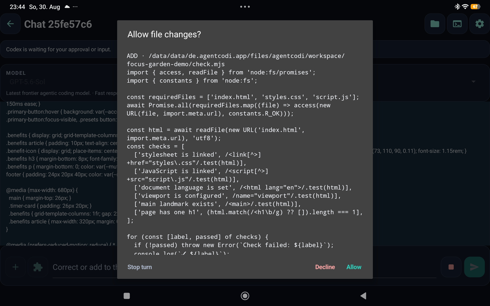
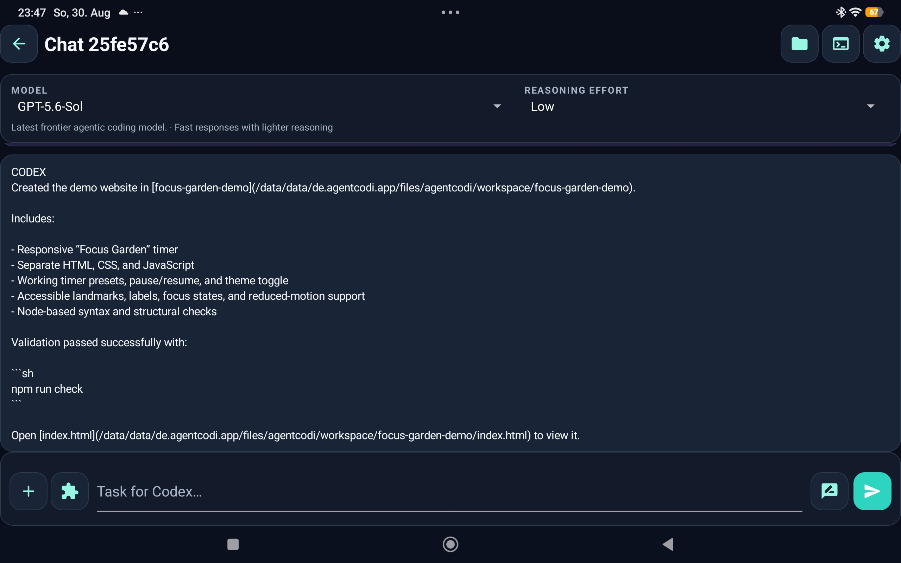
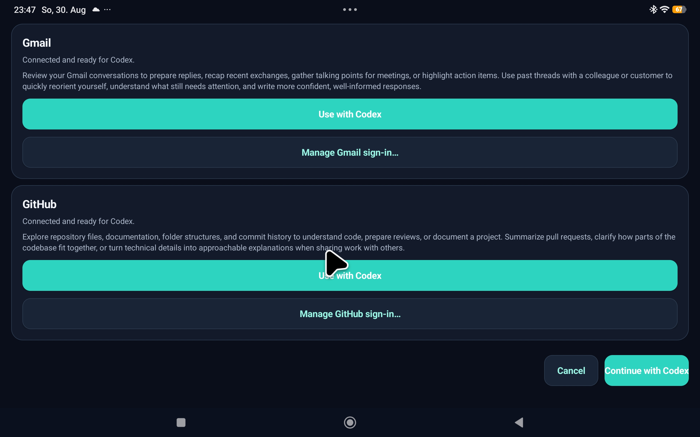

<div align="center">

# AGENTCODI

### Codex workflows, native on Android.

**Run the Codex app-server, workspace, approvals, terminal and supported development toolchains directly on your Android device.**

<br>


  [Releases](../../releases) . [Issues](../../issues)
<br>

**No Termux required to use AGENTCODI. No WebView shell. No separate gateway setup.**

</div>

---

 <p align="center">
  
  &nbsp;
  
  &nbsp;
  
</p>

---


## Codex development in your pocket

AGENTCODI is a native Android app that turns an ARM64 phone or tablet into a workspace for Codex.

Tell Codex what you want to build, change or understand. You can follow its work live, answer questions, approve actions, inspect files and use a terminal without leaving the app.

The Codex app-server, workspace, terminal and included command-line tools run on your device. The AI model is not part of the APK: model requests still require an internet connection and valid OpenAI authentication.

---

## What you can do

- **Work with Codex through native chat.** Start or resume conversations, stream progress, add guidance while Codex is working, stop a turn and request a focused review.
- **See what is happening.** Messages, plans, reasoning summaries, commands, file changes and tool activity appear as clear cards in the conversation.
- **Manage real workspace files.** Import documents from Android, browse folders, preview text and images, inspect binary files and export a file or folder ZIP through the system document picker.
- **Use a real terminal.** Run interactive commands in the active workspace with keyboard input, live output and resize support.
- **Enable useful development tools.** Node.js, npm, Python and ripgrep are packaged with the app and can be activated when needed.
- **Choose how Codex works.** Select a supported model and reasoning level, view account quota information and respond to approval or input requests in native dialogs.
- **Bring in Gmail and GitHub.** Connect the hosted Codex apps in your browser, return to AGENTCODI and use either service with your next message.
- **Inspect advanced capabilities.** View available MCP servers, tools, skills and apps. Expert Mode can manage supported MCP server settings without exposing credential fields.

---

## A simple workflow

1. Open AGENTCODI and sign in with ChatGPT or an OpenAI API key.
2. Start a conversation and describe the result you want.
3. Follow the live activity and respond when Codex asks for approval or more information.
4. Open the workspace to inspect, preview or export the result.

Conversations can be resumed later, archived, restored or permanently deleted after confirmation. The interface is available in English and German, with light and dark themes.

---

## Native on Android

AGENTCODI is not a remote desktop or a browser wrapper. Its interface is written for Android, and the packaged Codex runtime is started locally inside the app.

| Runs on your Android device | Requires an online service |
|---|---|
| Native app interface | Codex model requests |
| Codex app-server | OpenAI authentication |
| Private workspace and file browser | Hosted Gmail and GitHub capabilities, when selected |
| Terminal and packaged tools | |

Gmail and GitHub sign-in is completed in the system browser. AGENTCODI does not collect or store provider passwords or tokens.

---

## Safety and control

AGENTCODI keeps its workspace in private app storage and separates it from Codex account data.

- **Protected mode is the default.** Codex works only inside the private workspace, and file changes are grouped into a preview where possible.
- **Approvals stay with you.** Supported command, file-change and input requests are shown in native dialogs and are never approved automatically.
- **Import and export are explicit.** Files enter or leave the workspace only after you choose them through Android's document picker.
- **Compatibility mode is clearly marked.** This experimental mode removes effective filesystem isolation for files reachable by the app. It requires an immediate warning and acknowledgement, remains visibly active and is not remembered after an unconfirmed restart.
- **Credentials stay separate.** Authentication is handled through the Codex account flow, and sensitive values are kept out of the workspace and app history.

---

## Requirements

| | |
|---|---|
| Android | Android 10 / API 29 or newer |
| Device | ARM64 |
| Connection | Internet access for Codex requests |
| Authentication | ChatGPT sign-in or OpenAI API key |
| Current release line | AGENTCODI 0.7.0 |
| Packaged Codex runtime | 0.153.2 |

---

## Get started

1. Download an APK from [Releases](../../releases).
2. Install it directly on a supported Android device.
3. Open **Settings** and authenticate with ChatGPT or an OpenAI API key.
4. Return to chat, start a new conversation and tell Codex what you want to do.

AGENTCODI is under active development. Reproducible bug reports are welcome through [GitHub Issues](../../issues).

---

## Build from source

The application and its tests are written in Java and C++. Run the host tests before building an APK:

```sh
./scripts/test.sh
./scripts/build-debug-apk.sh
```

The debug APK uses local test signing. Production builds use the separate release script and externally supplied signing credentials:

```sh
./scripts/build-release-apk.sh
```

Device installation and behavior must be validated separately on physical Android hardware.

Automatically increment version

```sh
./scripts/bump-version.sh
```

To update the pinned app server, run this script.

```sh
./scripts/update-codex-runtime.sh
```

Important: Update the documents, then run ./scripts/test.sh and ./scripts/build-debug-apk.sh.

---

## License

AGENTCODI's original application code, tests, resources, build automation and documentation are licensed under the [Apache License 2.0](LICENSE).

Licenses and notices for bundled third-party components are listed in [NOTICE.md](NOTICE.md) and in the app's legal notices screen.

---

<div align="center">

### Build with Codex directly from Android.

**AGENTCODI**

</div>

AGENTCODI is an independent open-source project and is not affiliated with or endorsed by OpenAI.
